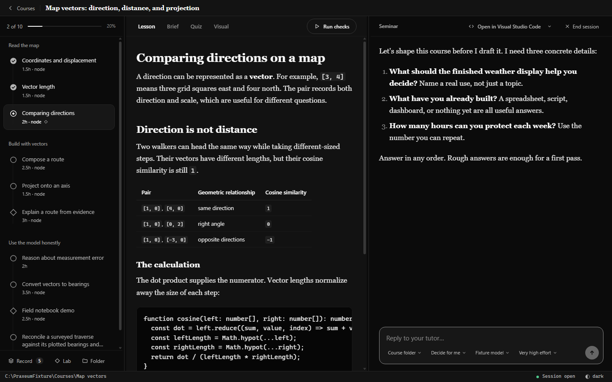

<div align="center">


# Lerience

**A real course from the model you already pay for.**

Lerience is a free, open-source desktop app that points your own Claude Code or Codex at a folder
and teaches you from it: an onboarding interview, a course plan you approve, one module at a time,
checks you run yourself, spaced recall, and a tutor that will not write the answer for you.

[lerience.com](https://www.lerience.com/) · [Download for Windows](https://github.com/sqmch/lerience/releases/latest) · [How a course is put together](#how-a-course-is-put-together) · [Honest limits](#honest-limits)

[](https://github.com/sqmch/lerience/releases/latest) [](https://github.com/sqmch/lerience/actions/workflows/ci.yml) [](LICENSE)

</div>



The course is a folder on your disk. Markdown files in that folder tell the model how to teach:
how to interview you before it plans anything, what to do at the start and end of every session,
when to withhold an answer, how to write the next module. The app is the interface around that
folder. No account, no server, no terminal.

## Install

1. Take the versioned `Lerience-Setup-...exe` installer from the
   [latest release](https://github.com/sqmch/lerience/releases/latest). Windows x64 only for now.
2. Have [Claude Code](https://claude.com/claude-code) or Codex installed and signed in. Lerience
   uses the client you already have; if it finds neither, it points you at the official installer.
3. Open Lerience, connect your provider, start a course.

> [!IMPORTANT]
> Releases are unsigned at the operating system level, so Windows will likely show an
> unknown-publisher warning. Lerience verifies its own updates with a signed manifest. Provider
> support is experimental. Read [honest limits](#honest-limits) before you install.

## Why this exists

Learning from a frontier model works. Ask one to explain something, argue with it, have it read
your attempt and tell you exactly which line is wrong, and you get something close to a patient
expert with all evening free.

Then you close the tab. Next week the model has no idea which part tripped you up, nothing you did
was checked, nothing got scheduled for review, and at no point did it have a reason to refuse to
hand you the answer. So it handed you the answer, and you learned less than you felt like you did.

Developers already know the shape of the fix, because it is how they work with agents now. Keep
the state in files and Git so it outlives the session. Write the rules down in an AGENTS.md. Give
the agent tests to run against your work and skills to reach for. It works far better than chat. It
is also a rig you assemble yourself, once per subject, out of parts built for shipping code rather
than learning it, and even assembled it is a terminal, an editor, and a review schedule you keep by
hand.

Lerience is that rig, built once and put behind an ordinary app. The model keeps every capability
it has. The rules live in files you are free to read. None of the setup is yours to do, whether you
have done it a hundred times before or would never have tried.

## How a course is put together

A course is a folder. This is what goes in it.

**`CLAUDE.md`** carries the tutor protocol, about 200 lines of plain markdown you can read in
ten minutes. It covers the onboarding interview, the open and close of every session, module
generation, hint policy, and the rule the tutor may never break. `AGENTS.md` points other agent
clients at the same file.

**`COURSE.md`** is the spine: your profile, the phases, the arc of modules, a pacing estimate, and
where the phase gates fall. The tutor drafts it after interviewing you. You then read it and push
back before a single module exists. The protocol treats that review as a hard gate, because a spine
gets expensive to change once modules hang off it.

**`curriculum/NN-name/`** holds one module, written when you get there. Each module has a lesson
written like a textbook chapter, a short brief for the build task, a runnable scaffold with the
load-bearing parts cut out, checks you run yourself, three sealed hints, and retrieval questions.
Some modules also carry a visual.

**`tutor/`** is the durable record. `progress.json` tracks module status, hint use, check attempts
and gate results. `quiz-bank.json` holds retrieval items with real spacing intervals. `journal.md`
is where the tutor writes, after every session, what you covered and where you struggled, in
specifics. "Confused X with Y", not "did the topic". The folder remembers so the model does not
have to.

Four scripts, `doctor`, `validate`, `qa` and `quiz`, own the parts that should never rest on a
model's judgment. They check that your recorded state is consistent, validate module formats, do
the spacing arithmetic, and prove that a module's checks pass against a sealed reference solution
and fail against the stripped scaffold before you ever see the module.

The app supplies the rest: a chat with the tutor, a pane for reading the lesson and brief, a view
of your progress and record, course creation in one click, recovery when a session is interrupted,
discovery of your installed provider client, a bundled Git and Node runtime, and a sandboxed stage
for interactive visuals.

## What a chat window and a fixed course cannot do

### It re-plans around you after every module

The spine holds once you agree to it. The content does not. Only the current module exists in full
at any moment, and the tutor writes the next one when you arrive, calibrated to how the last one
went. Pass the checks first try with no hints and the scaffold gaps widen. Need the third hint and
an intermediate stepping-stone task appears before the next real one. The journal carries forward
what confused you, what connected to work you had already done, which tangent you got interested
in. Every session opens with two or three retrieval questions that are actually due, most overdue
first. When the backlog is bigger than that, the tutor says so out loud rather than dropping the
rest.

This is the piece that matters most, and the hardest one to get anywhere else. A fixed course
cannot do it, because it was written before you arrived. A chat window cannot do it, because it
forgets. A good human mentor does exactly this, and that is the bar worth aiming at.

### The tutor will not do the work for you

The first rule in the protocol is that it never writes solution code. Learning happens in the gap
between the scaffold and the passing checks, so the tutor explains, asks what you think is
happening, points at the line, and releases one hint level at a time. It will not fill the gap,
including when you ask it to directly. Hints are sealed until you request one or you have clearly
been stuck for a while. The middle hint may not contain anything you can paste. Phase gates open
only when you pass them, and every attempt lands in the record, pass or fail. The protocol asks for
honest assessment over encouragement. "That passes, but why is this approach a problem at scale" is
the tone it wants.

### It builds a picture when prose is not enough

Frontier models are good at building things, and there is no reason to fence that off. When a
module turns on something spatial or dynamic, the tutor writes a self-contained visualization for
it, derived from the lesson it has just written so the examples and vocabulary match, then embeds
it in the chapter where the picture belongs. If a specific misconception shows up mid-session, it can retarget that visual at
the misconception on the spot. Lerience renders these in a sandbox with no network and no file
access.

The design intent, recorded in
[ADR-012](docs/DECISIONS/ADR-012-the-app-is-a-stage.md), is that the app is a stage for what the
model can build rather than a fixed set of widgets. Handcuffing the model into a few approved
components would throw away the thing it is getting better at fastest.

### Your course is a folder you own

It is files and Git history on your disk. You can read every rule the tutor follows and everything
it has recorded about you. You can open the folder directly in Claude Code or Codex and run the
whole course without Lerience. App updates never rewrite course content or your record.

## Principles

- **An ordinary learner experience.** No Node, no Git, no `PATH`, no terminal, no localhost
  service, no hosted control plane. Install, connect your provider, start a course.
- **The model at full capability.** The tutor is a real agent working in a real folder. It writes
  scaffolds, runs checks and performs the QA ritual. A tutor limited to typed tools could not run
  the protocol, which is why there is no hosted, API-metered version of this.
- **Structure in files, not in the app.** The course format, tutor protocol and scripts live in the
  course folder as the [Course Engine](course-engine/). The app renders those files, supervises the
  agent and the scripts, and hosts the visuals. It owns none of the content.
- **Local authority.** Course files, transcripts and tool execution stay on your machine. There is
  no Lerience account and no backend.
- **Provider-owned clients.** Lerience finds your installed Claude Code or Codex client. It does
  not bundle, download, update or copy provider executables, credentials or configuration. Sign-in,
  billing and terms stay between you and the provider.
- **Fail-closed distribution.** Lerience hashes every app-owned runtime file. An update needs an
  Ed25519 signature from the project plus an exact artifact size and SHA-256 match, and you still
  approve the download and the install.

## Honest limits

- **It suits domains where progress can be checked by running something.** Programming and its
  neighbors fit well. The protocol tells the tutor to say so plainly when a topic cannot produce
  runnable checks rather than quietly degrading, and you should expect less from it there.
- **You bring the subscription.** Lerience is free and MIT licensed. The tutor is your own Claude
  Code or Codex client, and it has to be installed and signed in already.
- **The ceiling is the model's ceiling.** The protocol raises the floor and the scripts catch a
  class of mistakes, but a generated module can still be wrong and the tutor can still misjudge
  you. The QA ritual exists because both happened.
- **Provider support is experimental** and subject to whatever each provider's current product and
  authentication terms say. Lerience claims no ownership of those products and no authorization
  beyond them.
- **Unsigned and early.** Public packages are currently Windows x64. Native Apple Silicon and Intel
  Mac DMGs are now part of the release lane. Physical Gatekeeper and learner-path acceptance still
  comes before the first public Mac release, including a run on a separate Intel Mac.

## Architecture

Lerience is an Electron and TypeScript application with three deliberate trust boundaries.

1. The sandboxed renderer displays local application content and sanitized course content through a
   narrow, typed preload API.
2. The main process owns course access, session lifecycle, provider discovery, updates and the
   deterministic application runtime.
3. Provider processes stay separately installed and provider-authenticated. Lerience supplies its
   own Git and course tooling without replacing your provider home or account.

[`course-engine/`](course-engine/) is the canonical course format, tutor protocol, schemas and
scripts. The public source and release repository is `sqmch/lerience`. The Windows product and
executable name is `Lerience` and the stable application ID is `io.github.sqmch.lerience`. Internal
`praxeum-*` identifiers are compatibility seams rather than branding, and they stay as they are.

## Development

You need Node.js 24 and pnpm 11.9.0. Native packaging targets Windows x64, Apple Silicon Macs, and
Intel Macs. Each target builds on a matching native host and carries its own reviewed runtime.

```powershell
pnpm install --frozen-lockfile
pnpm check
pnpm dev
```

`pnpm check` runs both TypeScript configurations, the application and Course Engine tests, ESLint,
Prettier, the production build, and the typecheck and build of the synthetic
[renderer harness](dev/renderer-harness/README.md). `pnpm audit:production` checks the production
dependency graph. Native packaging also needs an explicit preview or final application identity
and an assembled target runtime, described in [the distribution guide](distribution/README.md).

## Documentation

- [Product and architecture specification](docs/SPEC.md)
- [Interface design](docs/DESIGN.md)
- [Current status and decision ledger](docs/STATUS.md)
- [Architecture decision records](docs/DECISIONS/)
- [The tutor protocol](course-engine/template/CLAUDE.md) and
  [course visuals](course-engine/template/docs/LABS.md)
- [Release operations](distribution/RELEASE-OPERATIONS.md)

## Project policy and license

[CONTRIBUTING.md](CONTRIBUTING.md) covers development and review expectations. Security reports go
through the private process in [SECURITY.md](SECURITY.md), never a public issue.

The desktop source is under the [MIT License](LICENSE). The separately licensed Course Engine
template keeps its own [MIT license](course-engine/template/LICENSE), and bundled dependencies keep
their terms.
